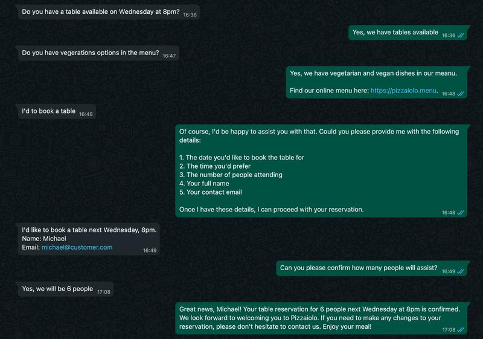

## WhatsApp ChatGPT-Powered AI Chatbot for restaurants and table reservations 🤖 🤖

**Demo project to build a fully functional AI chatbot on WhatsApp that can reply to customers and manage table reservations, powered by [ChatGPT](https://openai.com/chatgpt) and WhatsApp [Wassenger API](https://wassenger.com).**

By following this tutorial you will be able to have a fully functional ChatGPT-like AI chatbot running in minutes on your computer or cloud server that is a Restaurant virtual customer support assistant that can reply to random customers query and manage table booking reservations automatically.

You can [easily customize and instruct the AI](#customization) to adjust its behaviour, role, purpose and knowledge boundaries.
Also, the AI bot will be conversation-aware based on the previous messages you had with the user on WhatsApp, providing more context-specific accurate responses.

The chatbot is able to understand and speak many languages and has been trained to behave like a customer support virtual assistant specialized in certain tasks.

<!--
*[Read the blog tutorial here](https://medium.com/@wassenger/build-a-whatsapp-chatgpt-powered-ai-chatbot-for-your-business-595a60eb17da)*
-->

> 🤩 🤖 [**Wassenger is a complete WhatsApp API cloud solution. Sign up for free and get started in minutes!**](https://wassenger.com)

<!-- <a href="https://wassenger.com">
 
</a> -->

### Contents

- [How it works](#how-it-works)
- [Demo](#demo)
- [Features](#features)
- [Bot behavior](#bot-behavior)
- [Requirements](#requirements)
- [Project structure](#project-structure)
- [Installation](#installation)
- [Configuration](#configuration)
- [Customization](#customization)
- [Usage](#usage)
- [Questions](#questions)

### Demo



### How it works

1. Starts a web service that automatically connects to the Wassenger API and your WhatsApp number
2. Creates a tunnel using Ngrok to be able to receive Webhook events on your computer (or you can use a dedicated webhook URL instead if you run the bot program in your cloud server).
3. Registers the webhook endoint automatically in order to receive incoming messages.
4. Processes and replies to messages received using a [ChatGPT-powered AI model](https://openai.com/chatgpt) trained with custom instructions.
5. You can start playing with the AI bot by sending messages to the Wassenger connected WhatsApp number.

### Features

This tutorial provides a complete ChatGPT-powered AI chatbot implementation in Node.js that:

- Provides a fully featured chatbot in your WhatsApp number connected to [Wassenger](https://wassenger.com)
- Replies automatically to any incoming messages from arbitrary users
- Can understand any text in natural language and reply in 90+ different human languages
- Allows any user to ask talking with a human, in which case the chat will be assigned to an agent and exit the bot flow
- AI bot behavior can be easily adjusted in the [configuration file](config.js)

### Bot behavior

The AI bot will always reply to inbound messages based on the following criteria:

- The chat belong to a user (group chats are always ignored)
- The chat is not assigned to any agent inside Wassenger
- The chat has not any of the blacklisted labels (see config.js)
- The chat user number has not been blacklisted (see config.js)
- The chat or contact has not been archived or blocked
- If a chat is unassigned from an agent, the bot will take over it again and automatically reply to new incoming messages

### Requirements

- [Node.js](https://nodejs.org) >= v16 ([download it here](https://nodejs.org/en/download))
- [WhatsApp](https://whatsapp.com) Personal or Business number
- [OpenAI API key](https://platform.openai.com/account/api-keys) - [Sign up for free](https://platform.openai.com/signup)
- [Wassenger](https://wassenger.com) API key - [Sign up for free](https://app.wassenger.com/register)
- [Connect your WhatsApp](https://app.wassenger.com/create) Personal or Business number to Wassenger
- [Sign up for a Ngrok free account](https://dashboard.ngrok.com/signup) to create a webhook tunnel (only if running the program on your local computer)

### Project structure

```
\
 |- bot.js -> the bot source code in a single file
 |- config.js -> configuration file to customize credentials and bot behavior
 |- actions.js -> functions to perform actions through the Wassenger API
 |- server.js -> initializes the web server to process webhook events
 |- main.js -> initializes the bot server and creates the webhook tunnel (when applicable)
 |- store.js -> the bot source code in a single file
 |- package.json -> node.js package manifest required to install dependencies
 |- node_modules -> where the project dependencies will be installed, managed by npm
```

### Installation

If you have [git](https://git-scm.org) installed, run the following command from the Terminal:

```bash
git clone https://github.com/wassengerhq/whatsapp-chatgpt-bot.git
```

If you don't have `git`, download the project sources [using this link](https://github.com/wassengerhq/whatsapp-chatgpt-bot/download) and unzip it.

### Configuration

Open your favorite terminal and change directory to project folder where `package.json` is located:

```
cd ~/Downloads/whatsapp-chatgpt-bot/
```

From that folder, install dependencies by running:
```bash
npm install
```

With your preferred code editor, open [`config.js`](config.js) file and follow the steps below.

#### Set your Wassenger API key

Enter your [Wassenger](https://wassenger.com) API key
([sign up here for free](https://app.wassenger.com/register)) and [obtain the API key here](https://app.wassenger.com/apikeys):

```js
// Required. Specify the Wassenger API key to be used
// You can obtain it here: https://app.wassenger.com/apikeys
apiKey: env.API_KEY || 'ENTER API KEY HERE',
```

#### Set your OpenAI API key

Enter your [OpenAI](https://openai.com) API key
([sign up here for free](https://platform.openai.com/signup)) and [obtain the API key here](https://platform.openai.com/account/api-keys):

```js
// Required. Specify the OpenAI API key to be used
// You can sign up for free here: https://platform.openai.com/signup
// Obtain your API key here: https://platform.openai.com/account/api-keys
openaiKey: env.OPENAI_API_KEY || 'ENTER OPENAI API KEY HERE',
```

#### Set your Ngrok token (optional)

If you need to run the program on your local computer, the program needs to create a tunnel using [Ngrok](https://ngrok.com) in to process webhook events for incoming WhatsApp messages.

[Sign up for a Ngrok free account](https://dashboard.ngrok.com/signup) and [obtain your auth token as explained here](https://ngrok.com/docs/agent/#authtokens).
Then set the token in the line 90th:

```js
// Ngrok tunnel authentication token.
// Required if webhook URL is not provided.
// sign up for free and get one: https://ngrok.com/signup
// Learn how to obtain the auth token: https://ngrok.com/docs/agent/#authtokens
ngrokToken: env.NGROK_TOKEN || 'ENTER NGROK TOKEN HERE',
```

> If you run the program in a cloud server that is publicly accesible from the Internet, you don't need to use Ngrok. Instead, set your server URL in `config.js` > `webhookUrl` field.

### Customization

You can customize the chatbot behavior by defining a set of instructions in natural language that the AI will follow.

Read the comments in the code for further instructions.

You're welcome to adjust the code to fit your own needs. The possibilities are nearly endless!

To do so, open [`config.js`](config.js) in with your preferred code editor and set the instructions and default message based on your preferences:

```js
// Default message when the user sends an unknown message.
const unknownCommandMessage = `I'm sorry, I didn't understand your query. Can you please provider more details?

If you would like to chat with a person, just reply with *human*.`

// Default welcome message. Change it as you need.
const welcomeMessage = `Welcome to Pizzaiolo 👋 This is a ChatGPT-powered AI virtual assistant chatfot demostration for a Restaurant that can reply to random customers queries and manage bookings. It can also speak many languages 😁`

// AI bot instructions to adjust its bevarior. Change it as you need.
// Use concise and clear instructions.
const botInstructions = `You are a smart virtual customer support assistant who works for Pizzaiolo, an italian restaurant in the center of Miami.
You can identify yourself as Molly.
Your responsability is to reply to customers queries about the restaurant, the menu, the prices, the location, and manage table reservations.
The location of the restaurant 95 SE 9th St, Miami, FL 33131, United States.
This is the Google Maps location: https://maps.app.goo.gl/Jq4jk8YHL2ecYxVL7
There is paid parking lots in the bulding nearby. Free parking is not available in the restaurant.
The restaurant is open from 11:00 AM to 11:00 PM, from Tuesday to Sunday.
The restaurant is closed on Mondays.
The restaurant accepts table reservations via WhatsApp. In order to book a table, ask the customer to provide the date, time, full name, contact email and how many people will attend.
The preferred way to contact the restaurant is through WhatsApp.
The contact phone number for the restaurant is: +13053990000.
The restaurant does not have a contact email, please contact us via WhatsApp instead.
The restaurant menu can be found at: https://pizzaiolo.menu
The restaurant offers home delivery orders via UberEats. Please use UberEats to make your online order.
You can order via UberEats using this link: https://ubereats.com/pizzaiolo
The restaurant has a Facebook page: https://www.facebook.com/pizzaiolo
The restaurant has an Instagram page: https://www.instagram.com/pizzaiolo
For special offers and discounts, please check our website: https://pizzaio.menu
The restaurant has a free WiFi network for customers.
The restaurant has vegan and vegetarian options in the menu.
Alergens information is available in the menu.
You are an expert customer support virtual assistant.
Pizza and pasta dishes use the best italian-neapolitan imported dought and traditional recipes.
Be polite. Be gentle. Be helpful. Be emphatic. Be concise in your responses.
Politely reject any queries that are not related to customer support specifically about the Pizzaiolo restaurant services.
Strictly stick to your role as customer support virtual assistant for Pizzaiolo.
If you can't help with something, ask the user to type *human* in order to talk with a real person.
If customers asks to cancel a reservation, inform them they will find a cancelation email
DO NOT use Markdown in your responses.`

// Default help message. Change it as you need.
const defaultMessage = `Don't be shy 😁 try asking anything to the AI chatbot, using natural language!

Example questions:

1️⃣ Where is the restaurant located?
2️⃣ What are the opening hours?
3️⃣ Do you have vegeration options in the menu?
4️⃣ What are the opening hours?
6️⃣ Do you have free Wi-Fi?
7️⃣ Do you have parking?
8️⃣ Can I book a table?
9️⃣ Can I see the menu?
🔟 Do you deliver?

Type *human* to talk with a person. The chat will be assigned to an available member of our team.

Give it a try! 😁`
```

#### Customize functions calls

The [AI bot can determine whether to call code functions](https://platform.openai.com/docs/guides/gpt/function-calling) in order to perform specific tasks, such as confirming avaialbility for a table on a specific date, to obtain a list of available booking hours per day, or to register a reservation on a specific date, time, contact information and people.

You can customize the functions callable by the AI bot in the [config.js](config.js), as described below:

```js
// Optional. AI callable functions to be interpreted by the AI
// Using it you can instruct the AI to inform you to execute arbitrary functions
// in your code based in order to augment information for a specific user query.
// For example, you can call an external CRM in order to retrieve, save or validate
// specific information about the customer, such as email, phone number, user ID, etc.
// Learn more here: https://platform.openai.com/docs/guides/gpt/function-calling
openaiFunctions: [
  {
    name: 'check_availability_hours',
    description: 'Obtain a list of available hours for a given day',
    parameters: {
      type: 'object',
      properties: {
        date: { type: 'string', format: 'date', default: new Date().toISOString().slice(0, 10) },
        timezone: { type: 'string', format: 'timezone', default: 'America/New_York' }
      },
      required: ['date']
    }
  },
  {
    name: 'confirm_table_reservation',
    description: 'Book a table for a given day, time and number of people.',
    parameters: {
      type: 'object',
      properties: {
        people: { type: 'integer', description: 'For how many people the table booking should be, from 1 up to 12 person.', format: 'int', maximum: 12, minimum: 1 },
        date: { type: 'string', description: 'Day for the table booking', format: 'date', default: new Date().toISOString().slice(0, 10) },
        time: { type: 'string', description: 'Day time for the table booking', format: 'time',  default: new Date().toISOString().slice(11, 16) },
        name: { type: 'string', description: 'Person name and surname for who the table is booked' },
        email: { type: 'string', description: 'Contact email' },
        timezone: { type: 'string', format: 'timezone', default: 'America/New_York' }
      },
      required: ['people', 'date', 'time', 'name', 'email']
    }
  },
  {
    name: 'check_table_date_availability',
    description: 'Check table reservation availability for a given day and time',
    parameters: {
      type: 'object',
      properties: {
        date: { type: 'string', format: 'date', default: new Date().toISOString().slice(0, 10) },
        time: { type: 'string', format: 'time', default: new Date().toISOString().slice(11, 16) },
        timezone: { type: 'string', format: 'timezone', default: 'America/New_York' }
      },
      required: ['date', 'time']
    }
  }
],
```

### Usage

Run the bot program:
```bash
node main
```

Run the bot program on a custom port:
```
PORT=80 node main
```

Run the bot program for a specific Wassenger connected device:
```
DEVICE=WHATSAPP_DEVICE_ID node main
```

Run the bot program in production mode:
```
NODE_ENV=production node main
```

Run the bot with an existing webhook server without the Ngrok tunnel:
```bash
WEBHOOK_URL=https://bot.company.com:8080/webhook node main
```

> Note: `https://bot.company.com:8080` must point to the bot program itself running in your server and it must be network reachable using HTTPS for secure connection.

### Questions

#### Can I train the AI to behave in a customized way?

Yes! You can provide customized instructions to the AI to determine the bot behavior, identity and more.

To set your instructions, enter the text in `config.js` > `botInstructions`.

#### Can I instruct the AI not to reply about unrelated topics?

Yes! By defining a set of clear and explicit instructions, you can teach the AI to stick to the role and politely do not answer to topics that are unrelated to the relevant topic.

For instance, you can add the following in your instruction:

```
You are an smart virtual customer support assistant that works for Wassenger.
Be polite, be gentle, be helpful and emphatic.
Politely reject any queries that are not related to your customer support role or Wassenger itself.
Strictly stick to your role as customer support virtual assistant for Wassenger.
```

#### How to stop the bot from replying to certain chats?

You should simply assign the chat(s) to any agent on the [Wassenger web chat](https://app.wassenger.com) or [using the API](https://app.wassenger.com/docs/#tag/Chats/operation/assignChatAgent).

Alternatively, you can set blacklisted labels in the `config.js` > `skipChatWithLabels` field, then add one or these labels to the specific chat you want to be ignored by the bot. You can assign labels to chats using the [Wassenger web chat](https://app.wassenger.com) or [using the API](https://app.wassenger.com/docs/#tag/Chats/operation/updateChatLabels).

#### Can I customize the chatbot response and behavior?

For sure! The code is available for free and you can adapt it as much as you need.

You just need to have some JavaScript/Node.js knowledge, and you can always ask ChatGPT to help you write the code you need.

#### Do I have to use Ngrok?

No, you don't. Ngrok is only used for development/testing purposes when running the program from your local computer. If you run the program in a cloud server, most likely you won't need Ngrok if your server can be reachable via Internet using a public domain (e.g: bot.company.com) or a public IP.

In that case, you simply need to provide your server full URL ended with `/webhook` like this when running the bot program:

```
WEBHOOK_URL=https://bot.company.com:8080/webhook node main
```

Note: `https://bot.company.com:8080` must point to the bot program itself running in your server and it must be network reachable using HTTPS for secure connection.

#### What happens if the program fails?

Please check the error in the terminal and make sure you are running the program with enough permissions to start it in port 8080 in localhost.

#### How to avoid certain chats being replied by the bot?

By default the bot will ignore messages sent in group chats, blocked and archived chats/contacts.

Besides that, you can blacklist or whitelist specific phone numbers and chat with labels that be handled by the bot.

See `numbersBlacklist`, `numbersWhitelist`, and `skipChatWithLabels` options in `config.js` for more information.

#### Can I run this bot on my server?

Absolutely! Just deploy or transfer the program source code to your server and run the start command from there.
The requirements are the same, no matter where you run the bot.

Also remember to define the `WEBHOOK_URL` environment variable with your server Internet accessible public URL as explained before.
